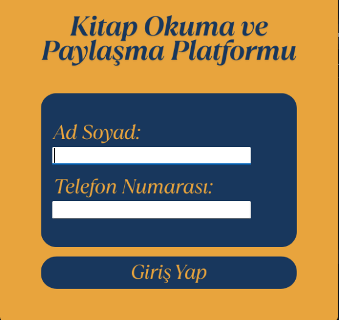
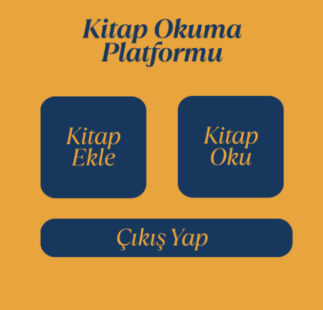
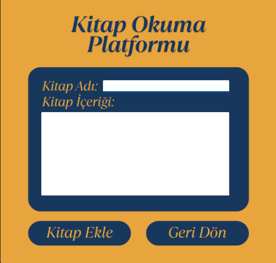
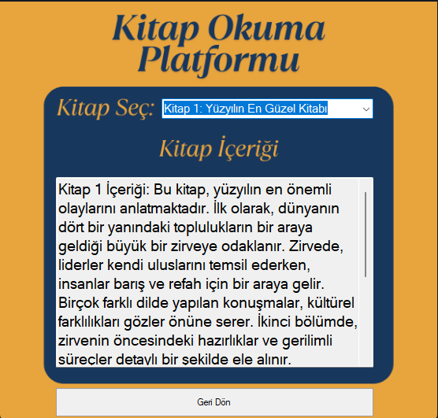

# 📚 Kitap Okuma ve Paylaşma Platformu

Bu proje, **C# Windows Forms** kullanılarak geliştirilmiş bir **Kitap Okuma ve Paylaşma Platformu** uygulamasıdır. Kullanıcılar, okudukları kitapları listeleyebilir, kitap önerilerinde bulunabilir, kitaplar hakkında yorum yapabilir ve diğer kullanıcıların paylaşımlarını görüntüleyebilir. Proje eğitim amaçlıdır.

## 🧩 Özellikler

- Kitap listesi oluşturma
- Kitap önerisi paylaşma
- Kitaplara yorum yapma
- Diğer kullanıcıların önerilerini görüntüleme
- Basit ve kullanıcı dostu arayüz

## 🛠️ Kullanılan Teknolojiler

- C# (Windows Forms)
- .NET Framework
- Visual Studio
- (Opsiyonel: JSON, XML ya da SQL Server ile veri saklama)

## 🖼️ Uygulama İçi Ekran Görüntüleri

  
  
  
  
